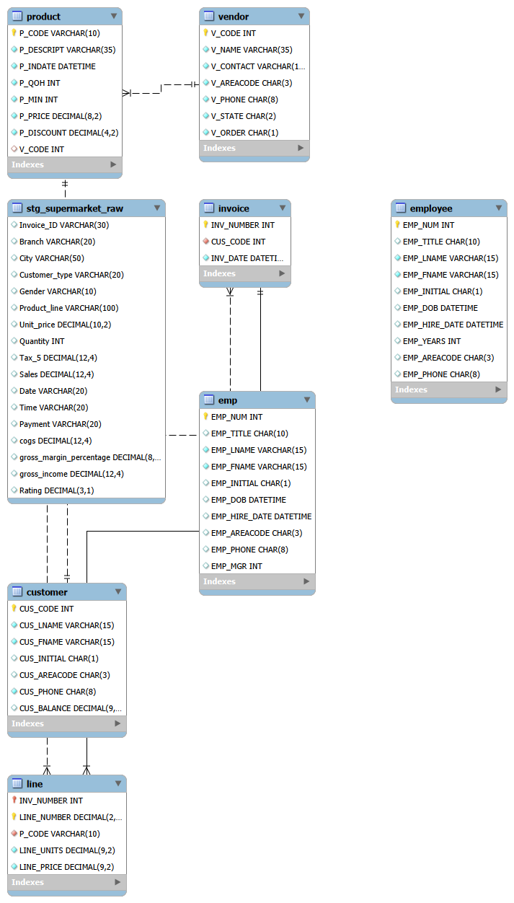

# Grocery Sales Data Warehouse

A MySQL 8.0 data warehouse built from a supermarket sales dataset. Group project for CIS 3050 (Database Management) at Cal Poly Pomona.

**Built with:** MySQL 8.0, MySQL Workbench, Excel

## What's inside

| Folder | Contents |
|--------|----------|
| `sql/` | `grocery_dw.sql` builds the staging table, dimensions, fact table, ETL steps, and report queries. `Munim_SQL_Invoice9002.sql` is the clerk-role transaction script. |
| `data/` | Source dataset (`supermarket_analysis.csv`) and a dataset description |
| `results/` | Table exports (customer, employee, invoice, line, product, vendor) |
| `screenshots/` | Table and report query output screenshots |
| `charts/` | Excel charts: sales by day of week, sales by month, top 5 products |
| `slides/` | Project presentation decks |
| `docs/` | Project overview, report SQL code, and folder guide |

## Run it

1. Open `sql/grocery_dw.sql` in MySQL Workbench and run the staging table section.
2. Import `data/supermarket_analysis.csv` into `stg_supermarket_raw` with the Table Data Import Wizard.
3. Run the rest of the script to build the dimensions, fact table, and reports.

Author: [Munim Awal](https://munimawal.com), with CIS 3050 teammates
